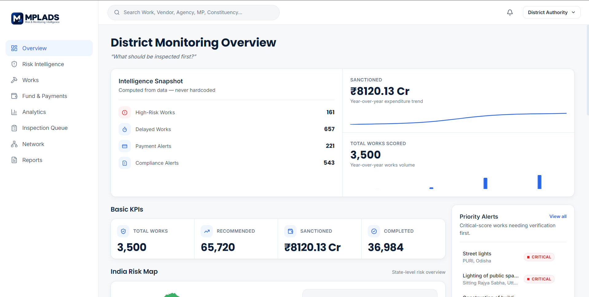
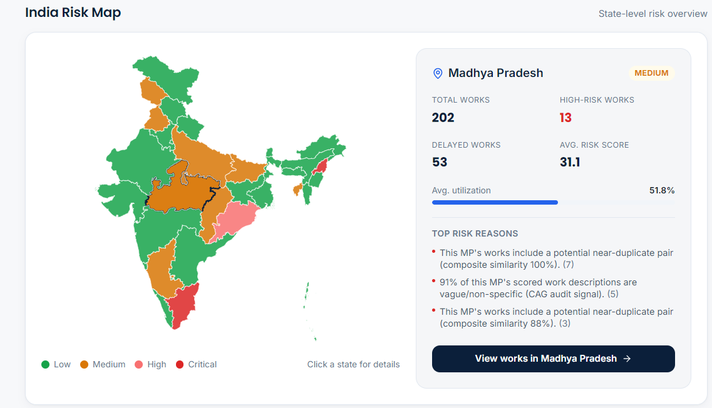
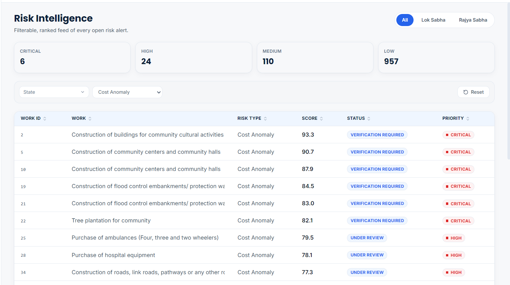
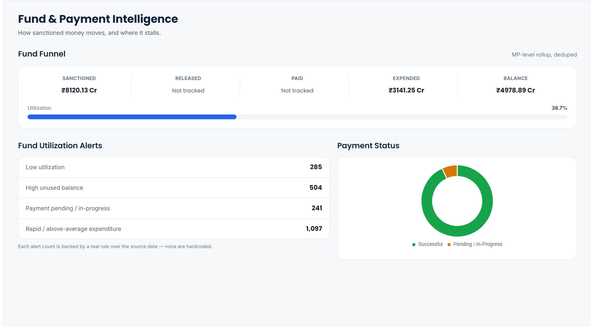
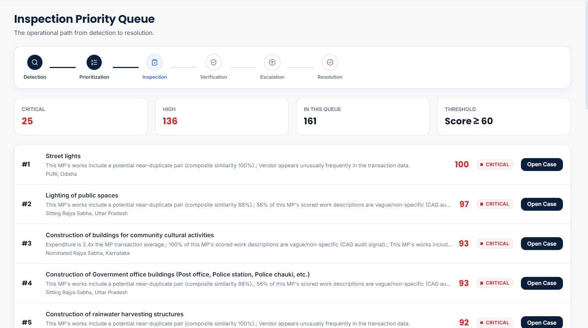
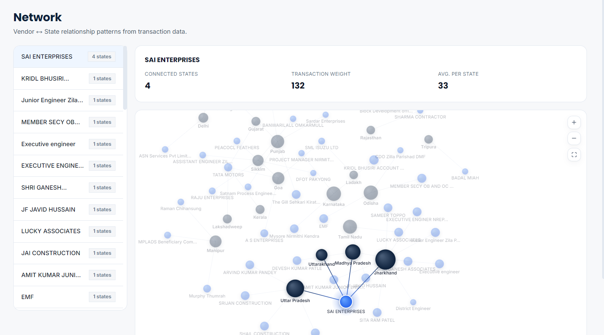

<div align="center">

# 🛰️ MPLADS AI — Risk & Monitoring Intelligence

**An explainable, risk-based intelligence layer over MPLADS transaction and project data.**
Turns raw MPLADS records into prioritized, evidence-backed verification actions for officials — a **decision-support tool**, not an automated fraud verdict.

[](https://mplads-topaz.vercel.app/login)
[](https://mplads-topaz.vercel.app/overview)
[](#backend)
[](#frontend)
[](#risk-engine)
[](#-team)
[](#-problem--solution)
[](#-problem--solution)
[](#-license)

<sub>Independent analysis prototype · not affiliated with, endorsed by, or a replacement for MPLADS / eSAKSHI or any government system.</sub>

<br>

> ### 🎯 *"AI Identifies where to Look First — Officials Verify and Decide."*

</div>

---

### ⭐ Quick pitch

> *"What should be inspected first?"*
> MPLADS AI ingests MPLADS expenditure, works, and summary data, engineers financial + payment + vendor features, runs an explainable NLP layer over free-text work descriptions, and scores every record with an Isolation Forest anomaly model — surfacing a **ranked, evidence-backed inspection queue** instead of a spreadsheet of 3,500 works.

<details>
<summary><b>📋 Problem Statement metadata (click to expand)</b></summary>
<br>

| Field | Value |
|---|---|
| Problem Statement ID | SIH26102 |
| Problem Statement Title | Development of an AI-powered System to Detect Anomalies, Fraud and Inefficiencies in MPLAD Scheme Implementation |
| Theme | Smart Automation |
| PS Category | Software |
| Team Name | GPT Co-workers |
| Team Leader | Ansh Varshney |
| Institute | IIT Madras BS Degree Programme |

</details>

<p align="center">
  <a href="#-live-links">Live Demo</a> •
  <a href="#-features">Features</a> •
  <a href="#-architecture">Architecture</a> •
  <a href="#-tech-stack">Tech Stack</a> •
  <a href="#-getting-started">Getting Started</a> •
  <a href="#-api-reference">API Reference</a> •
  <a href="#-screenshots">Screenshots</a> •
  <a href="#-team">Team</a>
</p>

---

## 🔗 Live Links

| Layer | URL | Notes |
|---|---|---|
| 🖥️ **Frontend** (Next.js app) | **[mplads-topaz.vercel.app/login](https://mplads-topaz.vercel.app/login)** | District/state/MP dashboards, risk map, inspection workflow |
| ⚙️ **Backend** (FastAPI service) | **[https://mpladas.onrender.com](https://mpladas.onrender.com/)** | Deployed alongside the frontend — see [API Reference](#-api-reference) for the `/api/*` routes it exposes |

> 💡 Prefer to run it yourself? Jump to [Getting Started](#-getting-started) for local backend + frontend setup.

---

## 🧭 Table of Contents

<details open>
<summary><b>Click to expand</b></summary>

- [Live Links](#-live-links)
- [Problem & Solution](#-problem--solution)
- [Features](#-features)
- [Architecture](#-architecture)
- [Tech Stack](#-tech-stack)
- [Screenshots](#-screenshots)
- [Getting Started](#-getting-started)
  - [Backend Setup](#️-backend-setup)
  - [Frontend Setup](#-frontend-setup)
- [API Reference](#-api-reference)
- [NLP → Risk Model Integration](#-nlp--risk-model-integration)
- [Project Structure](#-project-structure)
- [Feasibility & Viability](#-feasibility--viability)
- [Impact & Benefits](#-impact--benefits)
- [Research & References](#-research--references)
- [Data & Credibility](#-data--credibility)
- [Roadmap](#-roadmap)
- [Team](#-team)
- [License](#-license)

</details>

---

## 🎯 Problem & Solution

**Overview:** Existing MPLADS systems provide digital records, dashboards and monitoring of developmental works, but they do not *proactively* identify potentially irregular or high-risk works. With thousands of ongoing projects, manually spotting unusual spending, delays, duplication, or recurring patterns is difficult. **The challenge isn't a lack of data — it's knowing where to look first.**

<table>
<tr>
<td width="33%" valign="top">

### 😟 The Problem
- Officials can't examine every project with equal attention
- Some risk signals only surface when cost, delay, location, and history are viewed **together**
- By the time patterns surface in audits, timely correction may already be harder
- Officials need to know what deserves attention **first**, not a flat list

</td>
<td width="33%" valign="top">

### 💡 Our Solution
- Detects unusual expenditure, delayed or duplicate works, and other irregular patterns
- Assigns a **composite risk score** to every work
- **Explains** every alert with the reasons and evidence behind it
- Prioritizes high-risk works so officials focus time where it matters most

</td>
<td width="33%" valign="top">

### 🌟 What Makes It Different
- Adds an intelligence **layer on top of** MPLADS monitoring — doesn't replace it
- Connects project, spending, timeline, location, and history to spot cross-record patterns
- **Context-based risk**: compares similar works to reduce false positives
- Built for **action**, not just information — clear, explainable priorities

</td>
</tr>
</table>

---

## ✨ Features

<table>
<tr>
<td width="33%" valign="top">

### 🗺️ Risk Intelligence
- National **India risk map** (state-level, click-through drill-down)
- Filterable, ranked feed of every open risk alert
- Critical / High / Medium / Low severity buckets
- Every score backed by a real computed rule — **nothing hardcoded**

</td>
<td width="33%" valign="top">

### 💰 Fund & Payment Intelligence
- Sanctioned → Released → Paid → Expended fund funnel
- Utilization tracking & low-utilization alerts
- Payment status breakdown (successful vs. pending)

</td>
<td width="33%" valign="top">

### 🕵️ Inspection Workflow
- 6-stage pipeline: Detection → Prioritization → Inspection → Verification → Escalation → Resolution
- Priority queue sorted by risk score (threshold ≥ 60)
- One-click **"Open Case"** per flagged work

</td>
</tr>
<tr>
<td width="33%" valign="top">

### 🧠 Explainable NLP Layer
- Near-duplicate work detection (embeddings + fuzzy similarity)
- Entity extraction from free-text descriptions
- CAG-style vagueness/non-specificity scoring
- Plain-language explanation generation for every flag

</td>
<td width="33%" valign="top">

### 🔗 Network View
- Vendor ↔ State relationship graph from transaction data
- Surfaces vendors that repeat unusually often across states
- Transaction-weight sizing per node

</td>
<td width="33%" valign="top">

### 📊 Analytics & Reports
- State / district / agency / category / year-over-year aggregates
- Global search across Work, Vendor, MP, Constituency
- One-click CSV exports for risk & works registers

</td>
</tr>
</table>

---

## 🏗️ Architecture

The team's technical-approach model runs data through four stages with a continuous feedback loop:

```
 Data Sources          Ingest & Prepare        Intelligence & Analytics       Insights to Action
┌───────────────┐     ┌──────────────────┐    ┌───────────────────────┐    ┌────────────────────────┐
│ eSAKSHI data   │     │ Ingest            │    │ Rule Engine            │    │ Predictive Engine        │
│ OGD/data.gov.in│ ──► │ Valid & Clean     │──► │ ML Anomaly Detection   │──► │ Unified Risk Engine      │
│ Historical /   │     │ Transform & Load  │    │ NLP / Duplicate Detect.│    │ Explainability & Evidence│
│ Audit data     │     │ (data lake / DW)  │    │ Graph/Network Engine   │    │ Inspection Prioritization│
└───────────────┘     └──────────────────┘    │ Asset / Geo Analysis   │    │ Recommended Actions      │
                                               └───────────────────────┘    │ Role-Based Dashboard     │
                                                                            └────────────────────────┘
                    ▲──────────────────── Continuous Feedback & Learning Loop ────────────────────▲
```

**This repo's implementation of that model:**

```
 data/ (CSVs)  →  dataset_processor.py  →  NLP pipeline (entity_extraction,
 Expenditures ·                             duplicate_detection, category_
 Works · MPs                                classification, embeddings)
                                                        │  numeric signals only
                                                        ▼
                                   Risk Engine — Isolation Forest
                                   (financial + payment + vendor + NLP features)
                                                        │
                                                        ▼
                        FastAPI Backend (main.py)  ⚙️ https://mplads-topaz.vercel.app/overview
                                                        │
                                                        ▼
                   Next.js 16 Frontend (dashboards, risk map, queue)
                                        🖥️ https://mplads-topaz.vercel.app/overview
```

> 🔁 *Note (from the pitch deck): "Transforms MPLADS data into explainable risk insights and prioritised actions for timely verification."*

---

## 🧰 Tech Stack

<table>
<tr>
<td valign="top" width="50%">

**🔩 As shipped in this repo**

*Backend*
- Python 3 · FastAPI · Uvicorn
- pandas · NumPy · SciPy
- scikit-learn (Isolation Forest)
- RapidFuzz (duplicate similarity)
- Pydantic (schemas)

*Frontend*
- Next.js 16 · React 19 · TypeScript
- Tailwind CSS 4
- Chart.js / react-chartjs-2
- d3-geo + topojson-client (India risk map)
- GSAP (motion) · lucide-react (icons)

</td>
<td valign="top" width="50%">

**📐 Per the pitch deck's target stack**

*Core*
- Python · PostgreSQL · FastAPI
- ML / Statistical Models · NLP

*Supporting & Infrastructure*
- Next.js · Redis · Docker · Airflow

<br>

> The shipped prototype implements the Core layer end-to-end (SQLite/CSV in place of PostgreSQL for the hackathon build); Redis/Docker/Airflow are targeted for the production hardening pass — see [Roadmap](#-roadmap).

</td>
</tr>
</table>

---

## 📸 Screenshots

<details open>
<summary><b>District Monitoring Overview</b></summary>
<br>


*Intelligence snapshot, fund trend, basic KPIs, and priority alerts at a glance.*
</details>

<details>
<summary><b>India Risk Map</b></summary>
<br>


*State-level risk overview with drill-down — total works, high-risk works, avg. utilization, and top computed risk reasons.*
</details>

<details>
<summary><b>Risk Intelligence Feed</b></summary>
<br>


*Filterable, ranked feed of every open risk alert — Critical / High / Medium / Low, by risk type and status.*
</details>

<details>
<summary><b>Fund & Payment Intelligence</b></summary>
<br>


*Sanctioned → Expended funnel, utilization alerts, and payment status breakdown.*
</details>

<details>
<summary><b>Inspection Priority Queue</b></summary>
<br>


*The operational path from detection to resolution — top cases ranked by score, threshold ≥ 60.*
</details>

<details>
<summary><b>Vendor ↔ State Network</b></summary>
<br>


*Vendor relationship patterns from transaction data — connected states, transaction weight, avg. per state.*
</details>

---

## 🚀 Getting Started

### ⚙️ Backend Setup

```bash
# 1. Create & activate a virtual environment
python3 -m venv .venv
source .venv/bin/activate          # Windows: .venv\Scripts\activate

# 2. Install dependencies
pip install --upgrade pip
pip install -r requirements.txt

# 3. Run the API
uvicorn main:app --reload --port 8000
```

The source CSVs (`mplads_expenditures.csv`, `mplads_completed_works.csv`, `mplads_summary.csv`) ship in `data/`, so the API runs immediately. Swap in your own dataset via `/api/data/upload`, or replace the files (same names/columns).

| | |
|---|---|
| 📘 Swagger docs | `http://127.0.0.1:8000/docs` |
| 🔌 API base for frontend | `http://127.0.0.1:8000/api` |

### 🖥️ Frontend Setup

```bash
cd frontend
npm install
cp .env.example .env.local   # point at your backend if not localhost:8000
npm run dev
```

Open **`http://localhost:3000`**.

```bash
npm run build   # production build
npm run lint    # type-check + lint
```

---

## 📡 API Reference

<details>
<summary><b>Expand full endpoint list</b></summary>

| Endpoint | Purpose |
|---|---|
| `GET /api/health` | Backend / model health |
| `GET /api/data/summary`, `POST /api/data/upload`, `POST /api/model/train` | Data lifecycle |
| `GET /api/overview` | Dashboard KPIs, risk distribution, data coverage |
| `GET /api/geo/risk-by-state` | State-level risk aggregate for the India map |
| `GET /api/risk-intelligence`, `GET /api/risk/{work_key}` | Risk table + detail |
| `GET /api/works`, `GET /api/works/{work_key}` | Works register + full record |
| `GET /api/funds` | Fund utilization & payment overview |
| `GET /api/inspection/queue`, `POST /api/inspection/{work_key}/action` | Inspection workflow |
| `GET /api/network` | Vendor/state relationship data |
| `GET /api/analytics` | State/district/agency/category/YoY aggregates |
| `GET /api/search` | Global work/vendor/MP/constituency search |
| `GET /api/reports/risk.csv`, `GET /api/reports/works.csv` | CSV exports |
| `POST /api/nlp/*` | Entity extraction, duplicate detection, category classification, explanation generation, batch endpoints |

</details>

---

## 🧠 NLP → Risk Model Integration

During `prepare()`, the backend loads `outputs/nlp_mp_features.csv` if present; otherwise it runs `nlp_feature_pipeline.py` once against the completed-works CSV and caches the result.

The resulting numeric features — `NLP_Avg_Vagueness_Score`, `NLP_Max_Duplicate_Score`, `NLP_Vague_Work_Rate`, etc. — flow into the **same Isolation Forest** as the financial/payment/vendor features.

> 🔒 Raw work descriptions are **never** fed to the anomaly model directly — the NLP layer always converts them into explainable numeric signals first. Entity extraction and duplicate detection are memoized on description text, since MPLADS descriptions are heavily templated.

---

## 📁 Project Structure

```
MPLADAS-AI-main/
├── main.py                     # FastAPI app & routes
├── dataset_processor.py        # Cleaning + feature engineering
├── nlp_feature_pipeline.py      # NLP → numeric feature bridge
├── entity_extraction.py
├── duplicate_detection.py
├── category_classification.py
├── embeddings.py
├── classifier.py               # Isolation Forest risk model
├── explain.py                  # Plain-language explanation generation
├── schemas.py                  # Pydantic models
├── requirements.txt
├── data/                        # Source MPLADS CSVs
├── models/                      # Trained model artifacts
├── outputs/                      # Cached NLP feature outputs
└── frontend/                     # Next.js 16 application
    ├── app/
    ├── components/
    └── lib/
```

---

## ⚖️ Feasibility & Viability

The solution is designed to fit into the system that already exists, not replace it — using available data, supporting how officials already work, and focusing on making risk identification faster and more practical. **The main challenge isn't building the AI — it's making the insights reliable enough to be useful in real decisions.**

<table>
<tr>
<td width="50%" valign="top">

**Feasibility**

| Dimension | Why it holds up |
|---|---|
| 🔧 Technical | Uses established data, analytics and ML techniques — practical to build and deploy as an intelligence layer over existing MPLADS data |
| 💵 Economical | Builds on existing digital records and infrastructure; prioritizing high-risk works reduces the time/resources needed for large-scale manual monitoring |
| ⚙️ Operational | Fits the existing monitoring workflow by handing officials a prioritized list; AI flags and explains, officials retain final verification authority |

</td>
<td width="50%" valign="top">

**Challenges → Strategies**

| Challenge | Strategy |
|---|---|
| Data quality & completeness | Validate, clean, and cross-check records before generating risk scores |
| False positives | Use multiple signals + peer comparison + explainable reasons instead of a single ML prediction |
| AI adoption & trust | Keep the system decision-support focused — AI flags and explains, officials verify and decide |

</td>
</tr>
</table>

---

## 📈 Impact & Benefits

**Before → After**

| ❌ Without MPLADS AI | ✅ With MPLADS AI |
|---|---|
| Large volume of projects, examined unevenly | Automated data analysis across every record |
| Large-scale data spread across multiple records | Unified risk intelligence in one view |
| High-risk cases can be missed | Prioritised human verification, ranked by evidence |

**By dimension**

| | Benefit |
|---|---|
| 🌍 **Social** | Enhances public trust by making the use of public funds more transparent and strengthening timely oversight of MPLADS works |
| 💰 **Economic** | Reduces monitoring costs and resource wastage by prioritizing high-risk works for timely verification |
| ⚙️ **Operational** | Converts large volumes of project data into prioritized, explainable cases for verification and action |
| 🏛️ **Governance** | Strengthens accountability by giving MPs, District Authorities, State Nodal Authorities, and the Ministry clearer, role-specific risk insights |

---

## 📚 Research & References

Foundational research underpinning the approach:

| Source | Reference |
|---|---|
| **MoSPI — MPLADS / eSAKSHI** | Official MPLADS digital monitoring ecosystem — [mplads.mospi.gov.in](https://mplads.mospi.gov.in) |
| **CAG — Performance Audit of MPLADS** | Report No. 31 of 2010 — [cag.gov.in](https://cag.gov.in) |
| **MoSPI — PAIMANA** | Infrastructure & project monitoring framework — [paimana-proj.mospi.gov.in](https://paimana-proj.mospi.gov.in) |
| **European Commission — ARACHNE** | Risk scoring & targeted verification benchmark — [antifraud-knowledge-centre.ec.europa.eu](https://antifraud-knowledge-centre.ec.europa.eu) |
| **OECD — AI-Driven Fraud Detection** | Public-sector risk detection & data-driven oversight — [oecd.org](https://oecd.org) |

Research basis: the MPLADS digital ecosystem itself, CAG audit findings on compliance/fund-management/execution gaps, and risk-based monitoring approaches (ARACHNE+ and AI-based fraud detection) used as design benchmarks.

---

## 🔍 Data & Credibility

- All datasets are **real, publicly accessible MPLADS records** — never live-synced from a government system; the UI always labels this as a prototype dataset.
- Risk scores are an **investigation-prioritization signal, not a fraud verdict** — every screen frames output as decision support requiring official verification.

---

## 🗺️ Roadmap

- [ ] Live eSAKSHI/MPLADS data connector (replace static CSVs)
- [ ] Role-based access (District Authority / MP Office / Central Auditor)
- [ ] Model retraining pipeline with drift monitoring
- [ ] Vendor network graph → community detection for collusion patterns
- [ ] Mobile-friendly inspection app for field verification

---

## 👥 Team

**"GPT Co-workers"** — Smart India Hackathon 2026, Problem Statement **SIH26102**, IIT Madras BS Degree Programme
*AI-powered system to detect anomalies, fraud and inefficiencies in MPLAD Scheme implementation.*

| Name | Level | Role |
|---|---|---|
| Ansh Varshney *(Team Lead)* | Foundation | Frontend & Research |
| Priyansh Chaudhary | Diploma | AI & NLP — duplicate/near-duplicate detection, entity extraction, explanation generation |
| Naman Prabhakar | Diploma | Backend, APIs & Database |
| Jai Tyagi | Diploma | Machine Learning & Deep Learning |
| Anjali Sinha | Diploma | UI/UX & Documentation |
| Tanmay Gupta | Diploma | Data Analytics & Processing |

---

## 📄 License

MIT — see [`LICENSE`](LICENSE) for details.

<div align="center">

Made with ⚡ for **Smart India Hackathon 2026**

</div>
